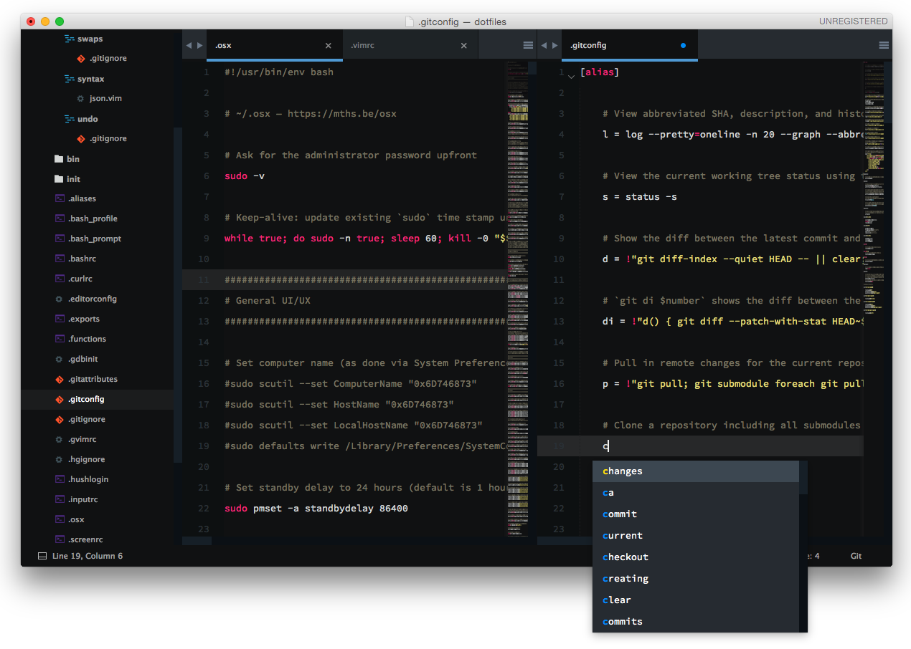

# Edu Wass' Sublime Text 3 settings



Note: I'm using the [Source Code Pro font](https://github.com/adobe-fonts/source-code-pro)

## Installation

### OS X
**1.** Open Sublime and install [Package Control](https://packagecontrol.io/installation), close it afterwards

**2. Run these commands**
```
cd $HOME/Sites
git clone git@github.com:eduwass/st3-settings.git
cd st3-settings
brew install hardlink-osx
rm $HOME/Library/Application\ Support/Sublime\ Text\ 3/Packages/User/Package\ Control.sublime-settings
hln Package\ Control.sublime-settings $HOME/Library/Application\ Support/Sublime\ Text\ 3/Packages/User/Package\ Control.sublime-settings
hln Preferences.sublime-settings $HOME/Library/Application\ Support/Sublime\ Text\ 3/Packages/User/Preferences.sublime-settings
hln Seti_monokai.tmTheme $HOME/Library/Application\ Support/Sublime\ Text\ 3/Packages/User/Seti_monokai.tmTheme
```

**3.** Launch Sublime and wait for Package Control to download and install all packages, might look weird and popup windows may emerge, just ignore until everything is installed and relaunch

### Windows
1. Install [Package Control](https://packagecontrol.io/)
2. Clone this repo to `$HOME/Sites`
3. Copy all files (except README and png) from repo to User path: `C:\Users\<username>\AppData\Roaming\Sublime Text 3\Packages\User`
4. Launch Sublime and wait for Package Control to download and install all packages, popup windows may emerge, ignore until everything is installed and relaunch

## Usage
(OSX) Cd into the repo's folder every now and then and push changes to save new settings to Github
